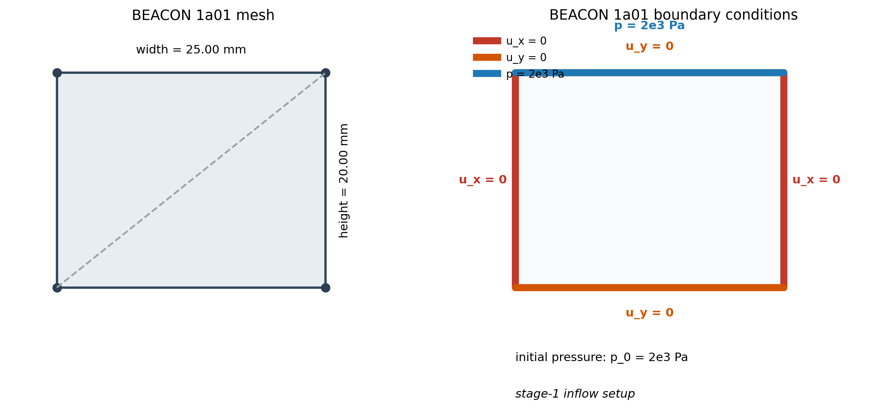
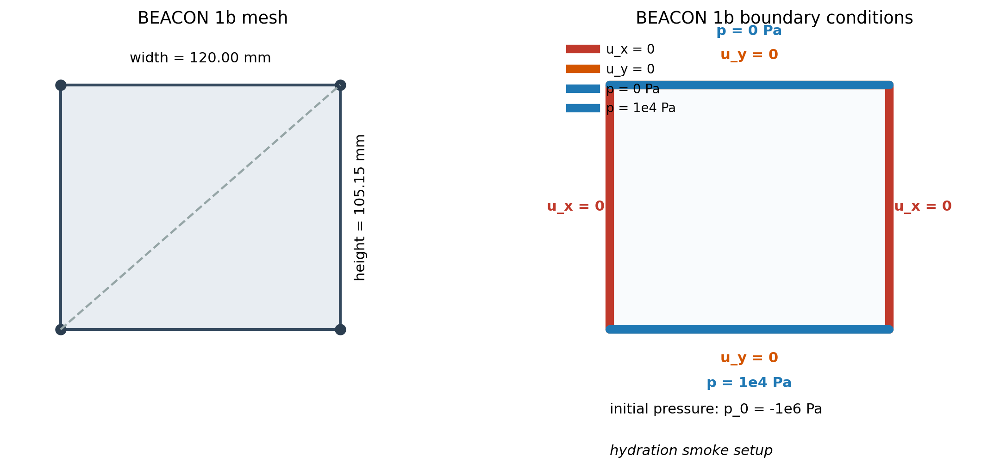

# RichardsMechanics DSM Native-vs-MFront Parity Plan

## Goal

Build an honest native-vs-MFront comparison for the RichardsMechanics
double-structure model (DSM) inside the same CTest slice.

The finished state should contain:

- one native DSM run
- one MFront bridge DSM run
- one native-vs-bridge comparison test on the same output fields and time steps
- zero tolerance where that is realistic, and only machine-scale tolerance
  where exact bitwise equality is not realistic

## Short version

Two things are already true:

- the reduced one-element native-vs-bridge compare works and is green
- the saturated elastic one-element native-vs-bridge compare also works and is
  exact
- the unsaturated elastic one-element native-vs-bridge compare also works and
  is exact once the native side uses the same Tuller saturation law as the
  notebook bridge
- a reduced same-law MCC native-vs-bridge compare also works and is green once
  the bridge side uses a pressure-coupled variant of
  `ModCamClay_semiExpl_constE`
- a benchmark same-law MCC native-vs-bridge compare now also works and is
  green on the native part-1 shell
- a widened notebook-MCC hybrid bridge can now carry notebook auxiliary state
  explicitly while still collapsing exactly to the verified MCC bridge when
  notebook coupling is neutral
- the hybrid bridge now also feeds notebook swelling back into the returned
  effective stress and `d\sigma/dp_L`, while still keeping the verified MCC
  saturation carrier surface unchanged
- a neutral notebook-MCC benchmark compare now also works and is green on the
  native part-1 shell
- a benchmark same-law MCC + notebook Tuller saturation compare now also
  works and is green on the native part-1 shell once that non-neutral
  saturation branch is substepped with `\Delta t = 1` over `t = 0..1000`

One thing is still open:

- full notebook-to-native DSM parity is still open, because the current
  notebook widening still covers only the Tuller saturation branch plus the
  swelling stress correction, not the full notebook-owned constitutive
  closure

So the remaining problem is no longer “can the benchmark bridge run?” and it is
no longer “can RM carry the native MFront MCC law through the pressure-coupled
bridge?”. The remaining problem is how far the notebook-derived bridge should
be widened toward that now-verified MCC benchmark surface.

## What is already verified

As of 2026-03-27 on branch `dsm-nb-mfront-transition`:

- the repository configures and builds with `OGS_USE_MFRONT=ON`
- this focused test slice passes:
  - `ogs-RichardsMechanics/mfront_restart_part1`
  - `ogs-RichardsMechanics/mfront_restart_part2`
- `ogs-RichardsMechanics_mfront_restart_part1_rm_bridge`
- `ogs-RichardsMechanics_mfront_parity_1element_native`
- `ogs-RichardsMechanics_mfront_parity_1element_bridge`
- `ogs-RichardsMechanics_mfront_parity_1element_compare`
- `ogs-RichardsMechanics_mfront_parity_1element_elastic_compare`
- `ogs-RichardsMechanics_mfront_parity_1element_unsat_compare`
- `ogs-RichardsMechanics_mfront_parity_1element_mcc_compare`
- `ogs-RichardsMechanics_mfront_restart_part1_mcc_compare`
- `ogs-RichardsMechanics_mfront_parity_1element_notebook_mcc_bridge`
- `ogs-RichardsMechanics_mfront_parity_1element_notebook_mcc_compare`
- `ogs-RichardsMechanics_mfront_parity_1element_notebook_mcc_tuller_native`
- `ogs-RichardsMechanics_mfront_parity_1element_notebook_mcc_tuller_bridge`
- `ogs-RichardsMechanics_mfront_parity_1element_notebook_mcc_tuller_compare`
- `ogs-RichardsMechanics_mfront_restart_part1_notebook_mcc_bridge`
- `ogs-RichardsMechanics_mfront_restart_part1_notebook_mcc_compare`
- `ogs-RichardsMechanics_mfront_restart_part1_notebook_mcc_tuller_native`
- `ogs-RichardsMechanics_mfront_restart_part1_notebook_mcc_tuller_bridge`
- `ogs-RichardsMechanics_mfront_restart_part1_notebook_mcc_tuller_compare`
- `MaterialLib_RMBridgeMFront_NotebookMCC.NeutralNotebookStateMatchesVerifiedMCCBridge`
- `MaterialLib_RMBridgeMFront_NotebookMCC.SwellingFeedbackChangesStressButKeepsCarrierSaturation`
- `MaterialLib_RMBridgeMFront_NotebookMCC.NotebookSaturationModeMatchesTullerLawAndKeepsStressSurface`
- the RM pressure-coupled carrier now keeps the bridge saturation derivative
  with respect to strain `dS/d\varepsilon`, and the pressure-equation
  displacement block now consumes that term instead of dropping it
- the native MPL now has `SaturationTuller`, so RM can use the same notebook
  saturation law on the native side when that is the honest comparison target

## Reduced one-element parity status

The reduced one-element pair is the current parity gate.

Compared fields:

- `displacement`
- `pressure`
- `sigma`
- `epsilon`
- `saturation`
- `swelling_stress`

Result:

- `displacement`: exact
- `pressure`: exact
- `epsilon`: exact
- `saturation`: exact
- `swelling_stress`: exact
- `sigma`: machine-scale residue only

Observed `sigma` residue:

- absolute max norm about `1.8e-12`
- relative max norm about `3.6e-16`

So the reduced one-element compare is closed for practical purposes.
The remaining `sigma` difference is a floating-point issue, not a model-parity
issue.

## Saturated elastic parity status

There is now also a separate saturated elastic one-element parity gate.

This pair uses:

- the same one-element RM shell on both sides
- native `LinearElasticIsotropic` on one side
- `RichardsMechanicsNotebookBridge` with `SwellingSlope = 0` on the other side
- a shared positive pressure ramp, so both sides stay on the saturated branch
  with `S_L = 1`

Compared fields:

- `displacement`
- `pressure`
- `sigma`
- `epsilon`
- `saturation`
- `velocity`

Result:

- all compared fields match exactly on timesteps `0` through `4`

What this means:

- the basic saturated elastic pressure-coupled RM bridge contract is working on
  this shared shell
- the remaining benchmark mismatch is therefore not explained by a generic
  failure of the bridge on the simplest elastic saturated branch
- the open benchmark problem must involve constitutive, unsaturated, or other
  process-level features beyond this branch

## Unsaturated elastic parity status

The first unsaturated elastic probe was useful because it showed that the old
native shell and the notebook bridge were not using the same saturation law.

That first probe used:

- the same geometry on both sides
- the same elastic stiffness on both sides
- zero displacement on all boundaries, so `u = 0` and `\varepsilon = 0`
- the same prescribed liquid-pressure history
  `p_L = (0, -2.5\times 10^5, -5\times 10^5, -7.5\times 10^5, -10^6)\,\text{Pa}`
- native `LinearElasticIsotropic` with the native medium saturation law
- bridge `RichardsMechanicsNotebookBridge` with
  `SwellingSlope = 0` and `MassExchangeCoefficient = 0`

This removes MCC plasticity from the picture. In that first probe, any
mismatch had to come from saturation, Bishop weighting, or the RM
pressure-coupled carrier.

### What the first probe showed

At first, the native side still used van Genuchten while the bridge used the
notebook Tuller law.

On the native side, the medium saturation was

\[
S_L^{nat} = S_{vG}(p_{cap}),
\qquad
p_{cap} = -p_L,
\]

while on the bridge side the direct material response followed
for `p_L < 0`

\[
S_L^{bridge}(p_L) = 1 - \exp\!\left(-\frac{A}{p_L^2}\right),
\]

\[
A = \frac{4\,\beta_T\,\gamma^2}{a_T\,r_c^2},
\]

where in the current bridge parameters

\[
\beta_T = 0.8584073464102069,
\quad
\gamma = 0.0715,
\quad
a_T = 1,
\quad
r_c = 10^{-5}\,\text{m}.
\]

After fixing the RM secondary-variable/state path so that pressure-coupled
materials keep their returned `S_L` instead of falling back to the medium law,
that first unsaturated elastic probe showed:

- `pressure`: exact
- `displacement`: exact
- `epsilon`: exact
- `sigma`: exact
- `velocity`: exact
- `saturation`: not equal from `ts_1` onward

Observed `saturation` values:

- `ts_0`: native `1`, bridge `1`
- `ts_1`: native `0.99956534554`, bridge `0.0028046311451`
- `ts_2`: native `0.99862233608`, bridge `0.00070189642845`
- `ts_3`: native `0.9972984069`, bridge `0.00031201481239`
- `ts_4`: native `0.99564897055`, bridge `0.00017552031277`

That result did not mean the bridge concept was wrong. It meant the native and
bridge probes were still asking different saturation questions.

### Alignment step that closes this gap

To make the comparison honest, the native side is now aligned to the notebook
law too.

The native medium can now use the same Tuller law through the new
`SaturationTuller` MPL property:

\[
S_L^{Tuller}(p_{cap}) =
\begin{cases}
1 - \exp\!\left(-\dfrac{A}{p_{cap}^2}\right), & p_{cap} > 0, \\[1ex]
1, & p_{cap} \le 0,
\end{cases}
\qquad
A = \frac{4\,\beta_T\,\gamma^2}{a_T\,r_c^2}.
\]

Because `p_{cap} = -p_L`, this is the same scalar law as the notebook bridge.

There is now a dedicated unsaturated elastic one-element CTest pair:

- native side:
  `LinearElasticIsotropic` + `SaturationTuller`
- bridge side:
  `RichardsMechanicsNotebookBridge` with
  `SwellingSlope = 0`, `MassExchangeCoefficient = 0`
- same pressure path:
  `p_L = (0, -2.5\times 10^5, -5\times 10^5, -7.5\times 10^5, -10^6)\,\text{Pa}`

Compared fields:

- `displacement`
- `pressure`
- `sigma`
- `epsilon`
- `saturation`
- `velocity`

Result:

- all compared fields match exactly on timesteps `0` through `4`

So the old unsaturated elastic mismatch is now closed. It was caused by using
different saturation laws, not by a generic RM-vs-bridge inconsistency on the
shared elastic unsaturated branch.

## Reduced same-law MCC parity status

There is now also a reduced one-element same-law MCC gate.

This pair uses:

- the same one-element RM shell on both sides
- the same van Genuchten medium saturation law on both sides
- native `ModCamClay_semiExpl_constE` on one side
- `ModCamClay_semiExpl_constE_pressureCoupled` under
  `MFrontRichardsMechanics` on the other side

Compared fields:

- `displacement`
- `pressure`
- `sigma`
- `epsilon`
- `saturation`
- `velocity`
- `ElasticStrain`
- `EquivalentPlasticStrain`
- `PreConsolidationPressure`
- `PlasticVolumetricStrain`
- `VolumeRatio`

Result:

- all compared history fields match up to machine-scale floating-point residue
- the project-level parity CTest is green
- the focused material-point test is green

The observed residue is only round-off:

- `sigma` closes with `5e-11` absolute tolerance in the project-level compare
- the material-point tangent match closes with `1e-8` absolute tolerance

The focused material-point check also verifies the bridge-side pressure blocks:

- `dσ/dp_L = 0`
- `dS_L/dε = 0`
- `dS_L/dp_L` matches the native van Genuchten formula

What this means:

- native MFront MCC already works through the RM pressure-coupled bridge on a
  reduced shell
- no MCC law had to be reimplemented on the native OGS side
- the remaining benchmark ambiguity is now narrower than before
- the tracked benchmark gap is no longer a generic question of whether RM can
  carry native `ModCamClay_semiExpl_constE` through
  `MFrontRichardsMechanics`

### RM carrier bug that was hiding this

One RM bug was also found and fixed during this probe.

Before the fix, the bridge run exported the medium saturation in the
secondary-variable path, even after the constitutive update had returned a
different pressure-coupled saturation. That made the bridge output look
artificially close to the native output on unsaturated elastic shells.

The fix is in
`ProcessLib/RichardsMechanics/RichardsMechanicsFEM-impl.h`:

- the secondary-variable path now rebuilds the local
  `dS_L/dp_{cap}`, `\Delta S_L / \Delta p_{cap}`, and `d\chi/dS_L` terms
- after the constitutive update, it reapplies the pressure-coupled solid data
  so the stored/output `S_L` matches the bridge response

This fix does not close the benchmark mismatch by itself. What it does is make
the RM bridge state and output honest on unsaturated pressure-coupled runs.

## Benchmark-shell same-law MCC parity status

The tracked benchmark bridge shell now uses the same available MCC law as the
native benchmark:

- native benchmark law:
  `ModCamClay_semiExpl_constE`
- bridge benchmark law:
  `ModCamClay_semiExpl_constE_pressureCoupled`

The dedicated benchmark compare CTest runs both project files on the native
part-1 shell and compares:

- `displacement`
- `pressure`
- `sigma`
- `epsilon`
- `saturation`
- `velocity`
- `ElasticStrain`
- `EquivalentPlasticStrain`
- `PreConsolidationPressure`
- `PlasticVolumetricStrain`
- `VolumeRatio`
- `swelling_stress`
- `transport_porosity`
- `dry_density_solid`

Result:

- at `ts_0`
  - all compared fields are exact except for machine-scale `sigma`
- at `ts_1`
  - all compared fields still agree up to machine-scale residue only
  - `pressure` closes with absolute max norm about `1.82e-12`
  - `sigma` closes with absolute max norm about `5.82e-11`

So the same-law MCC benchmark parity task is now closed in practice. The new
project-level gate is:

- `ogs-RichardsMechanics_mfront_restart_part1_mcc_compare`

What remains open is not this same-law benchmark surface. What remains open is
the notebook-derived bridge law and how far it should be widened toward this
now-verified MCC benchmark boundary.

## Notebook-MCC hybrid bridge status

There is now a first widening step between the old reduced notebook bridge and
the verified MCC bridge.

New behaviour:

- `MaterialLib/SolidModels/MFront/RichardsMechanicsNotebookBridge_MCC.mfront`

New regression checks:

- material-point:
  `Tests/MaterialLib/MFront/RichardsMechanicsNotebookBridgeMCC.cpp`
- project-level reduced shell:
  `Tests/Data/RichardsMechanics/mfront_parity_1element_notebook_mcc_bridge.prj`
- compare driver:
  `scripts/cmake/test/CompareRichardsMechanicsMFrontNotebookMCCParity.cmake`

### What this new bridge does

It starts from the verified pressure-coupled MCC bridge surface and adds the
notebook auxiliary state variables as persistent process-visible state:

\[
\eta_{MCC}
=
\left(
\varepsilon^{el},
\Lambda_p,
p_c,
\varepsilon_v^p,
v^r
\right),
\]

\[
\eta_{NB}
=
\left(
n_l,
\rho_{lR},
\varepsilon_{sw},
\phi_m,
\phi_M,
\mu_{lR},
\hat{\rho}_l
\right).
\]

The current hybrid bridge stores

\[
\eta_{hybrid} = (\eta_{MCC}, \eta_{NB}),
\]

but its returned constitutive surface is still the verified MCC one:

\[
\mathcal{C}_{hybrid}^{(0)}(\varepsilon, p_L, \eta_{hybrid})
=
\mathcal{C}_{MCC}^{pc}(\varepsilon, p_L, \eta_{MCC}).
\]

The first hybrid step only widened the state. The current hybrid step adds the
first constitutive feedback too:

\[
\boldsymbol{\sigma}_{eff}^{hybrid}
=
\boldsymbol{\sigma}_{eff}^{MCC}
- K\,\Delta\varepsilon_{sw}\,\mathbf{I},
\qquad
\Delta\varepsilon_{sw}
=
\text{SwellingSlope}\,(n_l^{new} - n_l^{old}).
\]

At the moment, the saturation surface is still intentionally kept equal to the
verified MCC carrier surface:

\[
S_L^{hybrid} = S_L^{MCC},
\qquad
\frac{\partial S_L^{hybrid}}{\partial p_L}
=
\frac{\partial S_L^{MCC}}{\partial p_L},
\qquad
\frac{\partial S_L^{hybrid}}{\partial \varepsilon}
= 0.
\]

### What is already verified for the hybrid bridge

When notebook coupling is neutral,

\[
\text{SwellingSlope} = 0,
\qquad
\text{MassExchangeCoefficient} = 0,
\]

the hybrid bridge collapses to the verified MCC bridge on the same loading
path.

Verified equal outputs:

- `stress`
- `dStress_dStrain`
- `dStress_dLiquidPressure`
- `saturation`
- `dSaturation_dStrain`
- `dSaturation_dLiquidPressure`
- `ElasticStrain`
- `EquivalentPlasticStrain`
- `PreConsolidationPressure`
- `PlasticVolumetricStrain`
- `VolumeRatio`

Verified carried notebook state:

- `n_l`
- `rho_lR`
- `epsilon_sw`
- `phi_m`
- `phi_M`
- `mu_lR`
- `rho_l_hat`

Verified hybrid constitutive feedback:

- the returned stress differs from the verified MCC bridge exactly by the
  isotropic notebook swelling correction
- the returned `dStress_dLiquidPressure` matches a direct finite-difference
  probe on the active-swelling hybrid branch
- the returned `saturation`, `dSaturation_dLiquidPressure`, and
  `dSaturation_dStrain` stay identical to the verified MCC bridge on that same
  active-swelling branch

So this first widening step proves a narrow but important point:

- notebook state can be added to the bridge without breaking the verified MCC
  carrier surface
- notebook swelling can be fed back into the returned stress without breaking
  the verified MCC carrier saturation surface
- the benchmark shell can still collapse exactly to the verified MCC benchmark
  surface when notebook coupling is kept neutral

## The pressure-coupled contract in plain language

The key question is simple:

When the bridge returns stress and pressure derivatives, does RM interpret them
the same way the bridge means them?

### Continuum form

The quasi-static momentum balance is

\[
\nabla \cdot \boldsymbol{\sigma}_{tot} + \rho \mathbf{b} = \mathbf{0}.
\]

The liquid mass balance is

\[
\dot{m}_L + \nabla \cdot \mathbf{w}_L = q_L.
\]

In RichardsMechanics, total stress is built from effective stress by

\[
\boldsymbol{\sigma}_{tot}
=
\boldsymbol{\sigma}_{eff}
- \alpha \chi(S_L) p_L \mathbf{I}.
\]

So if the bridge returns effective stress, RM should add the pore-pressure
contribution once.

If the bridge already returns total stress, but RM still applies the same
pressure correction, the pore-pressure term is counted twice.

### Weak form

The weak form of momentum is

\[
\int_\Omega \boldsymbol{\varepsilon}(\delta \mathbf{u}) :
\boldsymbol{\sigma}_{tot}\, d\Omega
- \int_\Omega \delta \mathbf{u}\cdot \rho \mathbf{b}\, d\Omega
- \int_{\Gamma_t} \delta \mathbf{u}\cdot \bar{\mathbf{t}}\, d\Gamma = 0.
\]

The weak form of liquid mass balance is

\[
\int_\Omega \delta p \, \dot{m}_L \, d\Omega
+ \int_\Omega \nabla \delta p \cdot \mathbf{w}_L \, d\Omega
- \int_\Omega \delta p \, q_L \, d\Omega = 0.
\]

The important point is that the momentum equation depends on pressure through
`\sigma_tot`.
So a wrong stress meaning or a wrong pressure derivative changes the coupled
`u-p` Jacobian.

### Semi-discrete form

With standard FE interpolation,

\[
\mathbf{u}_h = N_u \mathbf{d},
\qquad
p_h = N_p \mathbf{p},
\qquad
\boldsymbol{\varepsilon}(\mathbf{u}_h) = B \mathbf{d}.
\]

The momentum residual is

\[
R_u(\mathbf{d},\mathbf{p})
=
\int_\Omega B^T \boldsymbol{\sigma}_{tot}\, d\Omega - f_{ext}.
\]

The pressure-to-momentum Jacobian block is

\[
K_{up}
=
\frac{\partial R_u}{\partial \mathbf{p}}
=
\int_\Omega B^T
\left(
\frac{\partial \boldsymbol{\sigma}_{tot}}{\partial p_L}
\right)
N_p\, d\Omega.
\]

The pressure equation also has a displacement-coupling block. If the liquid
storage contains a term like
\[
m_L \supset \phi \rho_{LR} S_L,
\]
then linearizing with respect to displacement gives the saturation-strain part
\[
K_{pu}^{(S)}
=
\frac{\partial R_p}{\partial \mathbf{d}}
\supset
\int_\Omega N_p^T \phi \rho_{LR}
\left(
\frac{\partial S_L}{\partial \boldsymbol{\varepsilon}}
\right)
B\, d\Omega.
\]

That first `dS/d\varepsilon` term was a real RM-side carrier omission. It is
now assembled.

This gave one useful negative result during the earlier notebook-bridge
investigation:

- restoring the `dS/d\varepsilon` carrier term was a real fix
- but it did not remove the old notebook-bridge benchmark gap by itself

So a notebook-derived benchmark gap can still come from a wrong meaning of:

- returned stress
- `dS/d\varepsilon`
- `dSigma/dp_L`
- `dS_L/dp_L`

even if the local bridge solve itself is finite and stable.

## What the current parity gate does and does not prove

### What it proves

The current one-element compare proves that the native and bridge paths agree
on the reduced shared shell that is actually being tested.

### What it does not prove

It does not prove:

- full notebook-to-native constitutive equivalence
- that the notebook-derived bridge law has already reached the same active
  constitutive closure as the verified MCC bridge

## Parameter status

For a parameter-by-parameter comparison of the reduced one-element pair, see:

- [RichardsMechanicsDSMBridgeParameterComparison.md](./RichardsMechanicsDSMBridgeParameterComparison.md)

Short version:

- the shared OGS setup is aligned well enough for the reduced parity CTest
- the active constitutive parameter sets are not literally the same
- the current green compare test is not an exact same-parameter MCC plasticity
  proof

## Work packages

### WP1: Keep the reduced one-element parity slice green

Status:

- complete

Acceptance criteria:

- native one-element run stays green
- bridge one-element run stays green
- compare CTest stays green
- only machine-scale tolerance is used where exact equality is not realistic

### WP2: Keep the benchmark shell loadable

Status:

- complete for run-level loadability

Guardrails:

- keep the pressure-consistent benchmark bridge IC
- keep the bridge microstate fallback
- keep the benchmark damping unless tests show it is safe to remove
- keep the direct benchmark-pressure bridge unit tests green

### WP3: Close the same-law benchmark quantitative gap

Status:

- complete

Completed result:

- compare clean native and bridge benchmark outputs on the part-1 shell
- enforce the comparison with a dedicated CTest
- keep only machine-scale tolerance for `pressure` and `sigma`

### WP4: Add the benchmark comparison CTest

Status:

- complete

Delivered test:

- `ogs-RichardsMechanics_mfront_restart_part1_mcc_compare`

### WP5: Add a notebook-MCC hybrid bridge that preserves the verified MCC surface

Status:

- complete

Delivered result:

- add `RichardsMechanicsNotebookBridge_MCC`
- carry notebook auxiliary state explicitly in the pressure-coupled bridge
- prove, with a material-point test and a reduced-shell CTest, that the hybrid
  bridge collapses to the verified MCC bridge when notebook coupling is neutral

### WP6: Feed notebook swelling back into the constitutive response

Status:

- complete

Delivered result:

- keep the verified MCC plastic core
- add the notebook isotropic swelling correction to the returned effective
  stress
- return the matching `dStress_dLiquidPressure`
- lock the active-swelling branch with a direct material-point regression

Target form:

\[
\boldsymbol{\sigma}_{eff}^{hybrid}
=
\boldsymbol{\sigma}_{eff}^{MCC}
- K_{sw}(\eta_{NB})\,\Delta \varepsilon_{sw}\,\mathbf{I}.
\]

Current verified boundary:

- the stress correction is active and tested
- the pressure tangent is active and tested
- the hybrid still preserves the verified MCC saturation carrier surface

### WP7: Decide whether notebook microstate should modify saturation or stay auxiliary

Status:

- complete for the current reduced hybrid boundary

Decision for the current branch:

- keep the returned saturation law on the verified MCC carrier surface for now
- keep notebook microstate as a stress-side widening step first
- prove on a direct active-swelling material-point test that `S_L`,
  `dS_L/dp_L`, and `dS_L/d\varepsilon` stay equal to the verified MCC bridge

What remains open later:

- whether a future notebook-driven branch should also widen the returned
  saturation law on the benchmark shell

### WP8: Benchmark the widened notebook hybrid against the verified MCC boundary

Status:

- complete for the neutral notebook branch

Delivered result:

- add `mfront_restart_part1_notebook_mcc_bridge.prj`
- keep notebook coupling neutral on that benchmark shell
- compare the shared benchmark fields against the native part-1 surface with
  `ogs-RichardsMechanics_mfront_restart_part1_notebook_mcc_compare`

What remains open later:

- rerun the benchmark on a non-neutral notebook branch once the intended final
  notebook constitutive feedback is defined

### WP9: Add a reduced same-law MCC + notebook saturation parity gate

Status:

- complete

Delivered result:

- add an optional notebook saturation mode to
  `RichardsMechanicsNotebookBridge_MCC`
- keep the existing neutral benchmark branch unchanged by default
- activate the notebook Tuller saturation law only when
  `NotebookSaturationMode = 1`
- lock that mode with a direct material-point regression
- add the reduced native-vs-bridge parity pair
  `mfront_parity_1element_notebook_mcc_tuller_native.prj` and
  `mfront_parity_1element_notebook_mcc_tuller_bridge.prj`
- enforce the reduced compare with
  `ogs-RichardsMechanics_mfront_parity_1element_notebook_mcc_tuller_compare`

Current verified boundary:

- reduced same-law MCC + notebook Tuller saturation parity is green
- the old neutral notebook benchmark path is still green
- the optional notebook saturation mode introduces only machine-scale residue
  in `pressure` and `sigma` on the reduced shell

What remains open later:

- benchmark-sized notebook widening beyond the current Tuller-only saturation
  branch

### WP10: Add a benchmark same-law MCC + notebook saturation parity gate

Status:

- complete for the current notebook Tuller saturation branch

Delivered result:

- add the native benchmark shell
  `mfront_restart_part1_notebook_mcc_tuller_native.prj`
- add the bridge benchmark shell
  `mfront_restart_part1_notebook_mcc_tuller_bridge.prj`
- keep the same native part-1 geometry, loads, and MCC material parameters
- activate the notebook Tuller saturation branch on the bridge side with
  `NotebookSaturationMode = 1`
- use the same Tuller saturation law and Bishop cutoff on the native side
- substep that non-neutral saturation benchmark with fixed `\Delta t = 1`
  over `t = 0..1000`
- emit only the start and end states on that benchmark pair
- enforce the benchmark compare with
  `ogs-RichardsMechanics_mfront_restart_part1_notebook_mcc_tuller_compare`

Current verified boundary:

- the native Tuller benchmark shell runs
- the bridge Tuller benchmark shell runs
- the native-vs-bridge benchmark compare is green
- the final-time benchmark residue is small and measured, not guessed:
  - `displacement`: about `9.75e-14`
  - `pressure`: about `8.02e-7` absolute and `2.65e-10` relative
  - `sigma`: about `8.15e-10`
  - `saturation`: about `1.97e-13`
  - `dry_density_solid`: about `2.99e-10`

What remains open later:

- notebook-owned non-neutral widening beyond the current Tuller saturation
  branch and swelling-stress correction

### WP11: Expose notebook support state on the hybrid MCC bridge

Status:

- complete

Delivered result:

- widen `RichardsMechanicsNotebookBridge_MCC` so it exposes the notebook
  support-state outputs `phi`, `n_S`, `n_L`, `rho_LR`, `omega_l`,
  `delta_epsilon_sw`, and `sigma_S`
- keep these outputs notebook-owned even when the returned RM carrier
  saturation stays on the verified MCC surface
- reuse the committed notebook overlap-transfer and anchored strain-coupled
  baseline CSVs as the direct support-state reference surface

Delivered tests:

- `MaterialLib_RMBridgeMFront_NotebookMCC.NotebookSupportStateMatchesOverlapTransferBaseline`
- `MaterialLib_RMBridgeMFront_NotebookMCC.NotebookSupportStateMatchesStrainCoupledBaseline`

Current verified boundary:

- the hybrid bridge now exposes the full notebook support state needed by the
  committed notebook overlap-transfer and strain-coupled histories
- the direct notebook support-state regressions are green
- the reduced and benchmark notebook-MCC compare CTests remain green after the
  widening step

What remains open later:

- notebook-owned non-neutral widening beyond the current support-state,
  swelling-stress, and Tuller-saturation steps

## BEACON smoke native-vs-bridge check

Status:

- completed as a direct run-and-compare study
- not promoted to CTest parity yet
- native branch smoke runs succeed in a separate native build
- bridge smoke copies run in the current MFront work tree

What was run:

- native side: direct `ogs` runs from branch `dsm-nb-transition`
  at commit `d46e11ac00` using
  - `beacon_1a01_vk_smoke.prj`
  - `beacon_1b_vk_smoke.prj`
  - `beacon_1c_vk_smoke.prj`
- bridge side: direct `ogs` runs from branch `dsm-nb-mfront-transition`
  at commit `c349ee2713` using
  - `Tests/Data/RichardsMechanics/beacon_1a01_vk_notebook_mcc_bridge.prj`
  - `Tests/Data/RichardsMechanics/beacon_1b_vk_notebook_mcc_bridge.prj`
  - `Tests/Data/RichardsMechanics/beacon_1c_vk_notebook_mcc_bridge.prj`
- comparison time: `t = 1000 s`
- comparison tool: `vtkdiff`
- overlap fields:
  - `1a01`: `displacement`, `pressure`, `saturation`, `swelling_stress`,
    `sigma`
  - `1b`: `displacement`, `pressure`, `saturation`, `swelling_stress`,
    `sigma`
  - `1c`: `displacement`, `pressure`, `saturation`, `porosity`,
    `transport_porosity`, `swelling_stress`, `sigma`

Bridge surface used:

- `RichardsMechanicsNotebookBridge_MCC`
- notebook saturation mode left on the native Van Genuchten carrier
- notebook swelling feedback kept neutral for this smoke check
- preconsolidation pressure kept high so the bridge stays elastic on these
  smoke cases

Comparison summary:

| Case | Native branch run | MFront branch run | Exact overlap fields | Nonzero overlap mismatch | Likely reason | Suggested solution |
| --- | --- | --- | --- | --- | --- | --- |
| `1a01` | yes | yes | `displacement`, `swelling_stress`, `sigma` | `pressure`: abs max `4.61e2`, rel max `4.78e-4`; `saturation`: abs max `1.84e-4`, rel max `2.52e-4` | Only the top pressure is fixed, so the interior state exposes the remaining storage-carrier difference between the native VK path and the bridge notebook state path. | Add a BEACON-specific notebook storage-carrier mode before making `1a01` a parity gate. A secondary convenience step is to port `vk_potential_exchange` into the MFront tree so both project families can be run by one executable. |
| `1b` | yes | yes | `displacement`, `pressure`, `saturation`, `swelling_stress`, `sigma` | none on the compared overlap fields | One medium and two pressure Dirichlet boundaries suppress the remaining carrier ambiguity. | Promote `1b` to the first exact BEACON native-vs-bridge compare gate. |
| `1c` | yes | yes | `displacement`, `porosity`, `swelling_stress`, `sigma` | `pressure`: abs max `7.12e1`, rel max `3.15e-4`; `saturation`: abs max `2.86e-5`, rel max `3.00e-5`; `transport_porosity`: abs max `2.00e-2`, rel max `8.00e-2` | The native VK path has a dedicated heterogeneous `transport_porosity` split update; the bridge path still uses the generic pressure-coupled carrier there. | Widen the bridge/process contract so the bridge can drive `phi_M` or `transport_porosity` explicitly on heterogeneous VK cases. A secondary convenience step is to port `vk_potential_exchange` into the MFront tree so both project families can be run by one executable. |

Main conclusion:

- the bridge BEACON copies do run for `1a01`, `1b`, and `1c`
- the native VK smoke decks also run, but in the separate native branch build
  rather than in the MFront executable
- the mismatch is not a generic elastic failure
- `1b` is already exact on the overlap fields
- the remaining BEACON work is concentrated on the native VK storage carrier
  and, for `1c`, the heterogeneous transport-porosity split

## BEACON matching

This section records the exact changes that were needed to make the bridge-side
`1a01` stage-1 inflow case reproduce the native stage-1 end state.

Scope:

- native target:
  `/Users/vinaykumar/Documents/GitHub/ogs/Tests/Data/RichardsMechanics/beacon_1a01_vk_inflow.prj`
- native reference end state:
  `/Users/vinaykumar/Documents/GitHub/ogs/Tests/Data/RichardsMechanics/beacon_1a01_vk_inflow_reference_t_100000.000000.vtu`
- bridge run deck:
  `Tests/Data/RichardsMechanics/beacon_1a01_vk_notebook_mcc_inflow_bridge.prj`
- bridge executable:
  `/Users/vinaykumar/git/build/release-mfront-tpm/bin/ogs`
- comparison time:
  `t = 100000 s`

### What had to match conceptually

The native `1a01` inflow case is sensitive to the local storage solve. The top
pressure is fixed, but the interior state is not, so the bridge had to replay
the same constitutive logic as the native scalar notebook-storage path.

The final bridge matching setup uses:

- the verified pressure-coupled MCC carrier for mechanics
- notebook microstate evolution for swelling and exchange
- a scalar notebook-storage local solve on `n_l`
- process-visible transfer of notebook exchange and notebook swelling stress

The three key constitutive relations are:

\[
\sigma_{\mathrm{eff}}^{\mathrm{hybrid}}
=
\sigma_{\mathrm{eff}}^{\mathrm{MCC}}
\sigma_S,
\qquad
\sigma_S = -K\,\epsilon_{sw}\,\mathbf I
\]

\[
\hat\rho_l
=
\alpha_M^{\mathrm{eff}}
\left(\mu_{LR}-\mu_{lR}\right),
\qquad
\alpha_M^{\mathrm{eff}}=\bar\alpha\,\rho_{LR}/\mu
\]

\[
R_{n_l}
=
n_l^{n+1}
- n_l^n
- \Delta t\,\hat\rho_l/\rho_{LR}^{\mathrm{ref}}
- n_l^{n+1}\,\Delta\varepsilon_v
= 0
\]

The first equation ensures that the added swelling stress is micro-driven. The
second and third equations ensure that the notebook exchange term enters the
same storage balance that the native scalar notebook-storage path uses.

### Code changes needed

| File | Change | Why it was needed for `1a01` matching |
| --- | --- | --- |
| `MaterialLib/SolidModels/MFront/RichardsMechanicsNotebookBridge_MCC.mfront` | Added material property `NotebookLocalSolveMode`; added scalar local-storage branch `use_scalar_notebook_storage`; kept `rho_lR = rho_LR_ref` in that branch; exposed `rho_l_hat` and `sigma_S`; kept the hybrid stress rule `sigma_eff^hybrid = sigma_eff^MCC + sigma_S` | The native `1a01` inflow path is driven by a scalar notebook-storage solve. Without this branch, the bridge used the older coupled `(n_l, rho_lR)` solve and drifted in `pressure` and `saturation`. |
| `MaterialLib/SolidModels/MechanicsBase.h` | Extended `PressureCoupledResponse` with `swelling_stress` and `liquid_mass_exchange_source` | The notebook bridge already knew `sigma_S` and `rho_l_hat`, but RM had no generic place to carry them out of the constitutive update. |
| `ProcessLib/RichardsMechanics/ConstitutiveRelations/PressureCoupledSolidData.h` | Added `swelling_stress` and `liquid_mass_exchange_source` to the bridge-side constitutive carrier | Needed to move the new bridge outputs into assembly and process-state storage. |
| `MaterialLib/SolidModels/MFront/MFrontRichardsMechanics.h` | Mapped internal variable `sigma_S` to public `swelling_stress`; mapped `-rho_l_hat` to `liquid_mass_exchange_source` | This is the bridge-to-RM handoff that makes the notebook support stress and notebook exchange source visible to the process. |
| `ProcessLib/RichardsMechanics/RichardsMechanicsFEM-impl.h` | Added `liquid_mass_exchange_source` to the pressure residual and wrote bridge `swelling_stress` into the process-owned swelling state | Without the residual source, the pressure equation ignored notebook mass exchange. Without the state write-back, the user-facing `swelling_stress` output stayed zero even when `sigma_S` and `sigma` were correct. |
| `Tests/MaterialLib/MFront/RichardsMechanicsNotebookBridgeMCC.cpp` | Added bridge regressions for the swelling-stress split and the native-aligned stage-1 local step | These tests prove the constitutive split before the FE run. |
| `Tests/ProcessLib/RichardsMechanics/PressureCoupledSolidData.cpp` | Added mapping checks for `swelling_stress` and `liquid_mass_exchange_source` | This protects the carrier path between MFront and RM assembly. |
| `Tests/Data/RichardsMechanics/beacon_1a01_vk_notebook_mcc_inflow_bridge.prj` | Added the dedicated bridge inflow deck | This is the first bridge BEACON deck that targets the full stage-1 end state at `t=100000 s`, not just the smoke state at `t=1000 s`. |

### Project and calibration choices used for the match

The `1a01` inflow match was not obtained by changing the geometry or the load
path. Those stay on the native stage-1 setup. The required calibration choices
were inside the bridge constitutive deck.

| Project quantity | Value in `beacon_1a01_vk_notebook_mcc_inflow_bridge.prj` | Purpose |
| --- | --- | --- |
| `InitialPreConsolidationPressure` | `1e10` | Keeps the MCC carrier elastic so the stage-1 swelling comparison is driven by the notebook microstate, not by plastic yielding. |
| `InitialVolumeRatio` | `1.6666666666666667` | Keeps the pressure-coupled MCC carrier on the same reference surface as the verified MCC bridge decks. |
| `NotebookLocalSolveMode` | `1` | Activates the scalar notebook-storage local solve that matches the native `scalar_notebook_storage` logic. |
| `MicroPotentialConvention` | `1` | Uses the native-aligned sign convention for the notebook micro-potential. |
| `NotebookSwellingSlope` | `0.1` | Transfers notebook micro-swelling into the returned stress. This is not an independent dominant macro swelling law; it is the coefficient that maps the micro swelling strain into the support stress `sigma_S = -K epsilon_sw I`. |
| `MassExchangeCoefficient` | `1e-13` | Keeps the micro-to-macro exchange rate on the committed notebook scale. |
| `MacroViscosity` | `1e-3` | Enters the native-style exchange scaling `alpha_M^eff = bar alpha rho_LR / mu`. |
| `n_l0` | `0.01` | Native-aligned initial notebook liquid content. |
| `rho_lR0` | `2276.031917690513` | Native-aligned initial micro liquid density for the stage-1 inflow state. |
| `epsilon_sw0` | `0.0` | Starts the notebook swelling strain from zero, so the stage-1 swelling stress is generated by the run itself. |

### Why each change was necessary

The matching problem had three layers.

1. The local storage solve had to match the native logic.
   The old bridge solve evolved `(n_l, rho_lR)` together. That is acceptable on
   reduced notebook tests, but it is not the same closure as the native scalar
   notebook-storage branch used by `1a01` inflow. Switching to
   `NotebookLocalSolveMode = 1` removed the remaining saturation mismatch.

2. The exchange source had to enter the pressure equation.
   The notebook bridge computes `rho_l_hat`, but until the bridge carrier was
   widened, RM did not use it in the pressure residual. After the widening, the
   pressure residual sees the source term
   `R_p <- R_p + integral N_p^T (-rho_l_hat) dOmega`.

3. The public swelling-stress output had to be populated from the bridge.
   Before the new `swelling_stress` carrier was added, the bridge already
   produced the correct support stress internally as `sigma_S`, but the user
   output `swelling_stress` stayed zero because only the native MPL path wrote
   that process-owned field.

### Final `1a01` stage-1 comparison at `t = 100000 s`

The current bridge inflow run is close to the native reference:

| Field | Native vs bridge end-state comparison |
| --- | --- |
| `pressure` | abs max `2.875603146608796e-02`, rel max `1.686365460364637e-04` |
| `saturation` | exact |
| `swelling_stress` | abs max `1.350759650645159e-01`, rel max `3.790781457621327e-05` |
| `sigma` | abs max `1.350759650654254e-01`, rel max `3.790781457646852e-05` |

This means the bridge now reproduces the stage-1 native end state to a very
good approximation, and it does so with micro-driven swelling:

- the swelling stress exposed to the user is the bridge notebook support stress
  `sigma_S`
- the hybrid stress gap relative to the plain MCC carrier is also `sigma_S`
- the remaining mismatch is small numerical residue in `pressure`, `sigma`, and
  `swelling_stress`, not a missing constitutive branch

### Practical boundary after the matching work

For BEACON `1a01` stage 1, the remaining work is no longer “make swelling
appear” or “make the bridge use the notebook exchange term”. Those are done.

What is still open:

- add a tracked compare CTest for the bridge inflow case once the tolerated
  thresholds are agreed
- extend the same storage-carrier treatment from `1a01` to the heterogeneous
  `1c` path, where `transport_porosity` is still native-specific
- port `vk_potential_exchange` into the MFront tree if one executable for both
  native and bridge project families is still desired

## BEACON report comparison for `1a01` and `1b`

This section compares the current native and bridge OGS runs against the
benchmark values reported in BEACON D5.1.1 for `1a01` and `1b`.

The comparison rules used here are:

- axial swelling pressure from OGS:
  `p_sw^ax = |sigma_yy|`
- radial swelling pressure from OGS:
  `p_sw^rad = |sigma_xx|`
- dry density from OGS:
  `dry_density_solid`

The current meshes for both `1a01` and `1b` are still one element through the
height. That means the present OGS runs can only produce a uniform end-state
dry-density field, not a resolved dry-density profile.

### Meshes and boundary conditions

The native and bridge comparisons in this section use the same specimen meshes
and the same boundary-condition layout. The figures below show the actual mesh
size and the active Dirichlet conditions for the compared `1a01` and `1b`
project files.



`1a01`: one quadrilateral element over a `25 mm x 20 mm` axisymmetric specimen.
The radial displacement is fixed on `left` and `right`, the axial displacement
is fixed on `bottom` and `top`, and the liquid pressure is prescribed on the
`top` edge with `p = 2e3 Pa`. The initial pressure is also `2e3 Pa`.



`1b`: one quadrilateral element over a `120 mm x 105.15 mm` axisymmetric
specimen. The displacement constraints are the same as in `1a01`. The liquid
pressure is prescribed on both axial faces: `p = 0 Pa` at the `top` and
`p = 1e4 Pa` at the `bottom`. The initial pressure is `-1e6 Pa`.

### What was taken from the report

For `1a01`, D5.1.1 gives two different targets:

- Table 3-1 gives the end of stage 1 (`intermediate`) at constant volume:
  - axial stress `604 kPa`
  - radial stress `994 kPa`
  - dry density `1655 kg/m^3`
- Table 3-2 gives the final post-mortem density profile after the full test,
  including stage 2 with added volume:
  - from bottom `2.5 mm`: `1466 kg/m^3`
  - from bottom `7.5 mm`: `1454 kg/m^3`
  - from bottom `12.5 mm`: `1427 kg/m^3`
  - from bottom `17.5 mm`: `1353 kg/m^3`
  - average: `1425 kg/m^3`

For `1b`, D5.1.1 gives:

- Table 4-3 after the volume adjustment:
  - dry density `1.52 g/cm^3 = 1520 kg/m^3`
- Figure 4-6 and the surrounding text:
  - swelling pressure is nonzero
  - a stabilized state is reached after about `500 days`

The extracted report text does not provide a tabulated dry-density profile for
`1b`, and it does not provide a machine-readable swelling-pressure plateau
value. So the `1b` report comparison is partly qualitative.

### Current native and bridge runs used here

| Case | Native run | Bridge run | End time used |
| --- | --- | --- | --- |
| `1a01` | `beacon_1a01_vk_inflow.prj` | `beacon_1a01_vk_notebook_mcc_inflow_bridge.prj` | `1e5 s` |
| `1b` | temporary long-horizon copy of `beacon_1b_vk_smoke.prj` | temporary long-horizon copy of `beacon_1b_vk_notebook_mcc_bridge.prj` | `4.32e7 s = 500 days` |

The `1b` long-horizon runs were temporary report-comparison runs only. They are
not committed CTests.

### Comparison table

| Case | Quantity | BEACON report target | Native OGS | MFront OGS | Match status | Main reason |
| --- | --- | --- | --- | --- | --- | --- |
| `1a01` | Stage-1 axial swelling pressure | `604 kPa` | `3.563 kPa` | `3.563 kPa` | strong mismatch | The current `1a01` inflow implementation builds only a very small support stress on the stage-1 path. |
| `1a01` | Stage-1 radial swelling pressure | `994 kPa` | `3.562 kPa` | `3.562 kPa` | strong mismatch | Same as above; both native and bridge remain far below the benchmark pressure level. |
| `1a01` | Stage-1 dry density | `1655 kg/m^3` | `1668.009 kg/m^3` | `1668.009 kg/m^3` | close | The current stage-1 case keeps dry density near the initial compacted state. |
| `1a01` | Final post-mortem dry-density profile after full test | `1466, 1454, 1427, 1353 kg/m^3` from bottom to top | uniform `1668.0 kg/m^3` field on a one-element mesh | uniform `1668.0 kg/m^3` field on a one-element mesh | mismatch and not fully comparable | The current OGS case is still stage-1 only, and the FE mesh has no axial resolution for a true profile. |
| `1b` | Dry density after volume adjustment | `1520 kg/m^3` | `1389.975 kg/m^3` | `1389.975 kg/m^3` | mismatch | The current surrogate uses `phi0 = 0.5`, which fixes the bulk dry density near `1390 kg/m^3` instead of the report value `1520 kg/m^3`. |
| `1b` | Swelling pressure after long saturation | nonzero and stabilized after about `500 days` | `0 kPa` | `0 kPa` | mismatch | The current `1b` native and bridge surrogates remain mechanically inactive even on the report-style time horizon. |
| `1b` | Dry-density profile | not tabulated in the extracted D5.1.1 text | uniform `1389.975 kg/m^3` field | uniform `1389.975 kg/m^3` field | report value not available, OGS unresolved | The report text gives a requested profile definition, but not a tabulated profile; the current OGS mesh is also too coarse to resolve one. |

### Interpretation

The current picture is now clear:

- `1a01`: native and bridge match each other well on the current OGS setup, but
  both are still far below the BEACON stage-1 swelling-pressure target.
- `1a01`: dry density is close to the stage-1 report value, but the current
  case cannot reproduce the final post-mortem profile because it does not yet
  include the second benchmark stage and it has only one element over the
  specimen height.
- `1b`: native and bridge again match each other, but they do not match the
  report-facing dry density or the nonzero swelling-pressure development.

So the current limiting factor is no longer native-vs-bridge disagreement for
these two cases. The limiting factor is benchmark realism of the OGS surrogate.

### Suggested next steps

- `1a01`: keep the current native/bridge matched stage-1 branch, but retune the
  microscale swelling path until stage-1 swelling pressure reaches the reported
  `604/994 kPa` range.
- `1a01`: add axial resolution and the second benchmark stage before claiming
  any match to the post-mortem dry-density profile in Table 3-2.
- `1b`: set the initial dry density to the reported `1520 kg/m^3` level first;
  without that, a swelling-pressure comparison is already off on the initial
  state.
- `1b`: after the density correction, check why the present constitutive branch
  still gives zero stress on a `500 day` run.

## BEACON report comparison on the shared unstructured batch

The one-element comparison above is still useful as a smoke-level baseline, but
it is not enough for any profile comparison. The new batch below repeats
`1a01` and `1b` on shared unstructured meshes with `162` triangular elements
and `100` points. The meshes are generated reproducibly by
`Tests/Data/RichardsMechanics/generate_beacon_unstructured_meshes.py`, and the
report-facing metrics are extracted by
`Tests/Data/RichardsMechanics/analyze_beacon_unstructured_batch.py`.

### Batch files

| Item | `1a01` | `1b` |
| --- | --- | --- |
| Unstructured mesh | `Tests/Data/RichardsMechanics/beacon_1a01_domain_unstructured_162e.vtu` | `Tests/Data/RichardsMechanics/beacon_1b_domain_unstructured_162e.vtu` |
| Native project | `Tests/Data/RichardsMechanics/beacon_1a01_vk_inflow_unstructured_batch.prj` | `Tests/Data/RichardsMechanics/beacon_1b_vk_unstructured_batch.prj` |
| Bridge project | `Tests/Data/RichardsMechanics/beacon_1a01_vk_notebook_mcc_inflow_unstructured_batch.prj` | `Tests/Data/RichardsMechanics/beacon_1b_vk_notebook_mcc_unstructured_batch.prj` |
| Final time used here | `1e5 s` | `4.32e7 s = 500 days` |
| Compared report quantity | stage-1 swelling pressure and density | long-time swelling pressure and density |

### How the batch was compared

- Axial swelling pressure from OGS:
  `p_sw^ax = |mean_top(sigma_yy)|`
- Radial swelling pressure from OGS:
  `p_sw^rad = |mean_outer(sigma_xx)|`
- Micro support stress diagnostic:
  `|mean(swelling_stress_yy)|` on the top boundary and
  `|mean(swelling_stress_xx)|` on the outer boundary
- Dry-density profile:
  average of `dry_density_solid` in `4` equal-height bins for `1a01` and `10`
  equal-height bins for `1b`

### Unstructured batch comparison table

| Case | Quantity | BEACON report target | Native unstructured | MFront unstructured | Native vs MFront | Match status | Main reason |
| --- | --- | --- | --- | --- | --- | --- | --- |
| `1a01` | Stage-1 axial swelling pressure | `604 kPa` | `2.846 kPa` | `2.847 kPa` | `0.00034 kPa` | strong mismatch to report, native vs MFront close | The dense mesh does not change the constitutive amplitude: both runs are still about two orders of magnitude below the report target. |
| `1a01` | Stage-1 radial swelling pressure | `994 kPa` | `3.553 kPa` | `3.554 kPa` | `0.00032 kPa` | strong mismatch to report, native vs MFront close | Same as above; the bridge reproduces the native stage-1 stress level but that level is still far below the report. |
| `1a01` | Top micro support stress `|swelling_stress_yy|` | not reported separately | `3.563 kPa` | `3.564 kPa` | `0.00033 kPa` | native vs MFront close | The micro-driven swelling branch is active here, but it still generates only a few kilopascals on the current calibration. |
| `1a01` | Mean dry density at stage 1 | `1655 kg/m^3` | `1668.011 kg/m^3` | `1668.011 kg/m^3` | `1.07e-05 kg/m^3` | close to report, native vs MFront exact for practical purposes | The dense mesh preserves the already-close stage-1 density level. |
| `1b` | Swelling pressure after `500` days, axial | nonzero and stabilized | `1.288 kPa` | `6.201 kPa` | `4.914 kPa` | both nonzero, native vs MFront mismatch, report still unresolved | The dense mesh removes the earlier zero-stress result, but the bridge is now visibly stiffer than the native run on `sigma_yy`. |
| `1b` | Swelling pressure after `500` days, radial | nonzero and stabilized | `3.001 kPa` | `2.835 kPa` | `0.166 kPa` | qualitative agreement only | Both runs are nonzero, but the report does not provide a machine-readable plateau value for a strict quantitative check. |
| `1b` | Top micro support stress `|swelling_stress_yy|` | not reported separately | `0 kPa` | `0 kPa` | `0 kPa` | constitutive mismatch to intended mechanism | The stress that appears on `1b` is not coming from the exported micro swelling support field; both runs still show zero `swelling_stress`. |
| `1b` | Mean dry density after volume adjustment | `1520 kg/m^3` | `1389.944 kg/m^3` | `1389.860 kg/m^3` | `0.084 kg/m^3` | strong mismatch to report, native vs MFront close | The current mixture surrogate is still anchored near the old `phi0 = 0.5` density level, far below the report target. |

### Dry-density profile tables

`1a01` report vs unstructured OGS profile (`4` equal-height bins):

| Height from bottom | BEACON report after full test | Native unstructured | MFront unstructured | Note |
| --- | --- | --- | --- | --- |
| `2.5 mm` | `1466 kg/m^3` | `1668.020 kg/m^3` | `1668.020 kg/m^3` | OGS is much denser; current run is only stage 1, not the full two-stage test. |
| `7.5 mm` | `1454 kg/m^3` | `1668.017 kg/m^3` | `1668.017 kg/m^3` | Same reason as above. |
| `12.5 mm` | `1427 kg/m^3` | `1668.009 kg/m^3` | `1668.009 kg/m^3` | Same reason as above. |
| `17.5 mm` | `1353 kg/m^3` | `1667.997 kg/m^3` | `1667.997 kg/m^3` | Same reason as above. |

`1b` unstructured OGS dry-density profile (`10` equal-height bins). The
extracted D5.1.1 text does not provide a tabulated profile, so only the report
average can be checked directly:

| Metric | BEACON report | Native unstructured | MFront unstructured | Note |
| --- | --- | --- | --- | --- |
| Average dry density | `1520 kg/m^3` | `1389.944 kg/m^3` | `1389.860 kg/m^3` | Both OGS runs are about `130 kg/m^3` below the report average. |
| Bottom-bin dry density | not tabulated | `1389.896 kg/m^3` | `1389.698 kg/m^3` | Native and bridge are close, but no report-side profile is available. |
| Top-bin dry density | not tabulated | `1389.994 kg/m^3` | `1389.988 kg/m^3` | The dense OGS profile stays almost flat over height. |
| Profile range over height | not tabulated | `1389.896` to `1389.994 kg/m^3` | `1389.698` to `1389.988 kg/m^3` | The bridge shows a slightly wider gradient, but the overall level is still far below the report average. |

### What the unstructured batch changes

- `1a01`: the dense unstructured mesh confirms that native and MFront remain
  close on the current stage-1 constitutive branch. The mismatch to the BEACON
  report is therefore not a mesh-resolution problem and not a native-vs-bridge
  problem. It is still a constitutive-calibration problem.
- `1a01`: the dense profile is now available, but it should not be over-read.
  The report profile is post-mortem after the full two-stage test, while the
  current OGS run is only the stage-1 inflow branch.
- `1b`: the dense mesh changes the qualitative picture. The old zero-stress
  result is gone. Both native and MFront now build nonzero total stress, but
  the bridge is noticeably stiffer than the native run in `sigma` even though
  `pressure` and `saturation` still match essentially exactly.
- `1b`: the dense batch also shows that the present `1b` stress is still not
  micro-swelling driven on the exported support-stress branch, because
  `swelling_stress` remains exactly zero in both runs.

### Suggested next steps from the unstructured batch

- `1a01`: keep the dense batch as the report-facing spatial benchmark, and tune
  the notebook micro branch so that the stage-1 micro support stress reaches
  the `604/994 kPa` report scale without handing the job over to a dominant
  macro swelling carrier.
- `1a01`: only compare against the post-mortem density profile after adding the
  second benchmark stage to the dense mesh case.
- `1b`: reset the initial density to the reported `1520 kg/m^3` level before
  reading too much into the long-time stress gap.
- `1b`: once the density is corrected, inspect why the bridge dense run stays
  exact in `pressure` and `saturation` but drifts in `sigma` by
  `max |Δsigma| = 11.17 kPa`. That is now the main dense native-vs-MFront
  mismatch on `1b`.
- `1b`: activate a genuinely micro-driven swelling contribution for the pellet
  mixture branch, because the current dense result still exports
  `swelling_stress = 0` in both native and bridge runs.

## Generated parity and benchmark files

These are the generated project and compare files that define the current
notebook-MCC saturation surfaces.

| File | What it runs | What it tests exactly |
| --- | --- | --- |
| `Tests/Data/RichardsMechanics/mfront_parity_1element_notebook_mcc_tuller_native.prj` | Native reduced one-element MCC shell with native MPL Tuller saturation and Bishop cutoff | Native reduced reference for the notebook Tuller saturation branch, with no bridge state |
| `Tests/Data/RichardsMechanics/mfront_parity_1element_notebook_mcc_tuller_bridge.prj` | Reduced one-element `RichardsMechanicsNotebookBridge_MCC` shell with `NotebookSaturationMode = 1` and neutral notebook swelling/mass exchange | Bridge reduced reference for the same Tuller saturation branch |
| `scripts/cmake/test/CompareRichardsMechanicsMFrontNotebookMCCTullerParity.cmake` | Runs the reduced native and bridge Tuller shells and compares their VTU outputs | Enforces reduced same-law MCC + notebook Tuller parity on `displacement`, `pressure`, `sigma`, `epsilon`, `saturation`, `velocity`, and MCC internal variables |
| `Tests/Data/RichardsMechanics/mfront_restart_part1_notebook_mcc_tuller_native.prj` | Native benchmark part-1 shell with native MPL Tuller saturation and Bishop cutoff | Native benchmark reference for the non-neutral notebook Tuller saturation branch on the part-1 geometry and load scale |
| `Tests/Data/RichardsMechanics/mfront_restart_part1_notebook_mcc_tuller_bridge.prj` | Benchmark part-1 `RichardsMechanicsNotebookBridge_MCC` shell with `NotebookSaturationMode = 1`, neutral notebook swelling/mass exchange, damped Newton, and fixed `\Delta t = 1` | Bridge benchmark reference for the same Tuller saturation branch |
| `scripts/cmake/test/CompareRichardsMechanicsMFrontNotebookMCCTullerBenchmarkParity.cmake` | Runs the benchmark native and bridge Tuller shells and compares the start and end states | Enforces benchmark same-law MCC + notebook Tuller parity on the part-1 shell |

## Definition of done

### Reduced one-element task

Done means:

- the native and bridge one-element shells both run
- the compare CTest is green
- all compared fields match exactly except for justified machine-scale residue

### Benchmark task

Done means:

- the native and bridge benchmark shells both run on the native part-1 scale
- the benchmark fields match up to only justified machine-scale residue
- the benchmark comparison is enforced by a dedicated CTest

Current state:

- done for the same-law MCC benchmark surface
- done for the same-law MCC + notebook Tuller benchmark surface
- not done for full notebook-to-native constitutive equivalence

## Useful commands

Configure:

```bash
cmake -S /Users/vinaykumar/git/ogs-TPM_Swelling_MCC_Coupled \
  -B /Users/vinaykumar/git/build/release-mfront-tpm \
  -DCMAKE_BUILD_TYPE=Release \
  -DOGS_USE_MFRONT=ON \
  -DCPM_SOURCE_CACHE=/Users/vinaykumar/git/.cpm-cache \
  -DTFELHOME=/Users/vinaykumar/.cache/CPM/_ext/TFEL/895fd7874cfa49079f7711831b3fa10069d8eee57388ab29ff17c265f8ffe777 \
  -DMFRONT=/Users/vinaykumar/.cache/CPM/_ext/TFEL/895fd7874cfa49079f7711831b3fa10069d8eee57388ab29ff17c265f8ffe777/bin/mfront \
  -DMFRONT_QUERY=/Users/vinaykumar/.cache/CPM/_ext/TFEL/895fd7874cfa49079f7711831b3fa10069d8eee57388ab29ff17c265f8ffe777/bin/mfront-query
```

Focused CTest slice:

```bash
ctest --test-dir /Users/vinaykumar/git/build/release-mfront-tpm \
  --output-on-failure \
  -R 'ogs-RichardsMechanics/mfront_restart_part1$|ogs-RichardsMechanics/mfront_restart_part2$|ogs-RichardsMechanics_mfront_restart_part1_rm_bridge$|ogs-RichardsMechanics_mfront_restart_part1_mcc_compare$|ogs-RichardsMechanics_mfront_restart_part1_notebook_mcc_compare$|ogs-RichardsMechanics_mfront_restart_part1_notebook_mcc_tuller_(native|bridge|compare)$|ogs-RichardsMechanics_mfront_parity_1element_native$|ogs-RichardsMechanics_mfront_parity_1element_bridge$|ogs-RichardsMechanics_mfront_parity_1element_compare$|ogs-RichardsMechanics_mfront_parity_1element_notebook_mcc_bridge$|ogs-RichardsMechanics_mfront_parity_1element_notebook_mcc_compare$|ogs-RichardsMechanics_mfront_parity_1element_notebook_mcc_tuller_compare$'
```

Direct benchmark-pressure bridge guardrail:

```bash
/Users/vinaykumar/git/build/release-mfront-tpm/bin/testrunner \
  --gtest_filter='MaterialLib_RichardsMechanicsNotebookBridgeMFront.PlaneStrainFactoryPathZeroDtBenchmarkPressureConsistentExactRMStateResponse:MaterialLib_RichardsMechanicsNotebookBridgeMFront.PlaneStrainFactoryPathBenchmarkPressureConsistentExactRMStateFirstStepResponse:MaterialLib_RichardsMechanicsNotebookBridgeMFront.PlaneStrainFactoryPathBenchmarkPressureConsistentProcessFailureStateResponse'
```

Notebook-MCC hybrid guardrail:

```bash
/Users/vinaykumar/git/build/release-mfront-tpm/bin/testrunner \
  --gtest_filter='MaterialLib_RMBridgeMFront_NotebookMCC.*'
```
